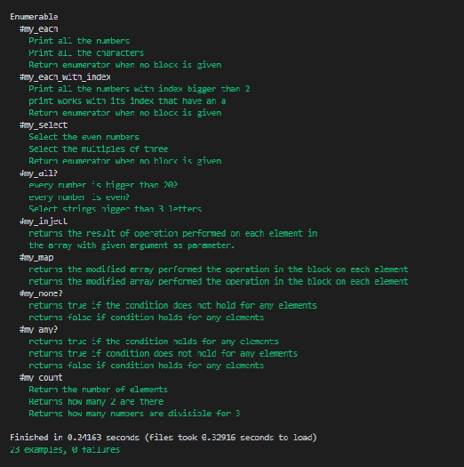

# Advanced Building Blocks - Enumerables & Testing Your Ruby Code - Enumerable

This is a Ruby project to demonstrate the diferent Enumarables methods using the following methods:

1 - each
2 - any?
3 - select
4 - inject
5 - each_with_index
6 - all?
7 - none?
8 - count
9 - map

# Enumerables

This methods takes and input and returns the same result as the original methods they are based on.

# Intention of this code

This diferent methods where created with the intend to have a better understanding of the methods that are available on Ruby. Yield and call command has been used inside the methods definition to achieve this.

# Testing with Rspec

In the Ruby Code Testing - Numerous Methods project, we've added specifications for each of the many methods we've created before.
Positive and negative scenarios for the tests were taken into account.
# Run tests
To start testing from the console, call: rspec spec\enumerable_spec.rb

## Built With

- Ruby
- RSpec

## Authors

👤 Ricardo

- Github: [@ricardo123321](https://github.com/ricardo123321)

👤 Oksana Petrova

- GitHub:[@github/Laguna1](https://github.com/Laguna1)
- Linkedin:[linkedin/OksanaPetrova](https://www.linkedin.com/in/oksana-petrova-005bb0145/)

## 🤝 Contributing

Contributions, issues and feature requests are welcome!

Feel free to check the [issues page](https://github.com/ricardo123321/Enumerables/issues).

## Show your support

Give a ⭐️ if you like this project!
